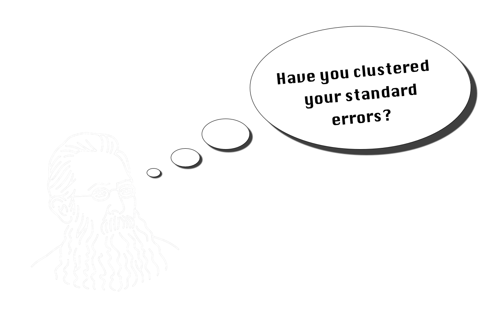

# Cluster-Robust  Heteroskedasticity-Consistent Standard Errors

This repository explains and illustrates a variety of cluster-robust heteroskedasticity-consistent standard error estimators. It was created by <a rel="creator" href="https://twitter.com/DuzgunDilsiz">Düzgün Dilsiz</a> (University of Basel) for teaching purposes. 

## File structure

This repository consists of 2 folders:
* code: provides the `R`-code for cluster-robust `HC0-HC4` standard error estimators with examples
* pictures: resources for readme.md

## License

 This work is licensed under a <a rel="license" href="http://creativecommons.org/licenses/by/4.0/">Creative Commons Attribution 4.0 International License</a>.
